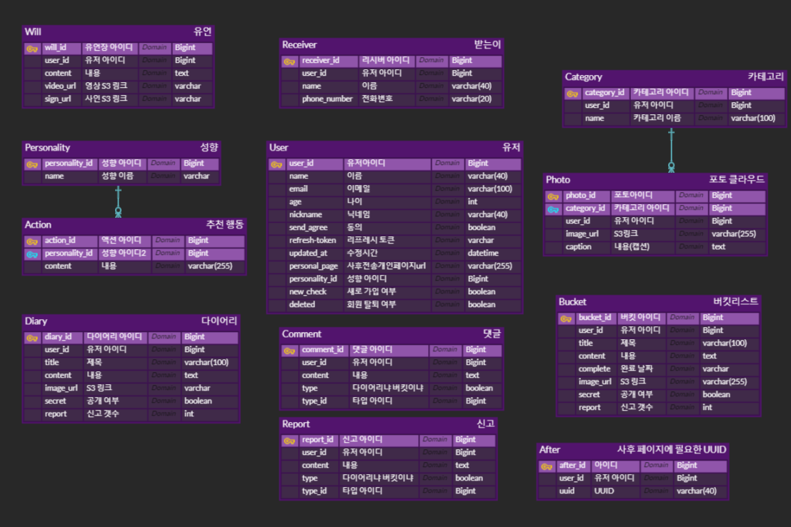

#  🌙 If I Die Tomorrow - 자율 PJT
SSAFY 8기 2학기 A307 자율 프로젝트 - If I Die Tomorrow Test

## 🚩 If I Die Tomorrow - 개요
**기간**
2023.04.10(월) ~ 2023.05.19(금) 

**배경**
If I Die Tomorrow는 웰다잉을 쉽게 준비할 수 있도록 도와주는 서비스입니다.
웰다잉은 죽음을 인식하고, 죽음으로부터 다시 자신의 삶을 돌아보는 활동입니다.
웰다잉에 대한 사람들의 인식도 높아지고 있고, 국가적으로도 웰다잉을 적극 권장하고 있습니다.

**문제점**
- 기존 웰다잉 서비스의 타겟층이 고령층에만 한정되어 있음
- 사용자의 삶을 정리해주는 서비스 부재
- 유가족과 남겨진 지인들을 위한 서비스 부재

**기대효과**

- 더 많은 사람들이 존엄한 죽음을 준비할 수 있습니다.
- 유가족들은 사용자가 남긴 정리된 데이터를 수령함으로서 위안을 얻습니다.
- 사용자는 삶의 의지를 찾고 의미 있는 삶을 추구할 수 있습니다.

**프로젝트 목표**
"전세대가 웰다잉을 쉽게 준비할 수 있는 모바일 기반 Web 서비스"

## 🚩 주요 기능
1. **포토클라우드** 
	(1) 커스텀 테마 기능 
	(2) 사진 업로드 기능 
	(3) 클릭 이벤트를 통한 interactive 체험 기능
	
2. **다이어리** 
	(1) 성향 설문 조사 
	(2) 성향에 맞는 데일리 글귀 및 액션 추천 
	(3) 다이어리 작성 
	(4) 공개/비공개 설정을 통한 커뮤니티에 글 공유 
	
3. **버킷리스트** 
	(1) 버킷리스트 작성 기능 
	(2) 버킷리스트 완료 처리 및 공유 기능 
	
4. **유언장 작성** 
	(1) 폼 데이터를 이용한 유언장 작성 기능 
	(2) 비디오를 이용한 유언장 작성 기능 
	
5. **사후전송 서비스** 
	(1) 미접속사용자 알림 기능 
	(2) sms 전송 기능 
	(3) Zip Generate & 다운로드 기능 

6. **커뮤니티**
	(1) 댓글 남기기
	(2) 신고 기능

7. **마이페이지**
	(1) 사후 전송 페이지 수신자 기입
 
## 🚩 주요 기술
1. Language
 - Java 11
 - Typescript 4.9.5

2. Framework
 - Springboot 2.7.10
 - React 11.10.6
 
3. DB
 - MySQL 8.0.32
 
4. OS
 - Linux Ubuntu 20.04 LTS
 
5. Server
 - AWS EC2

6. CI/CD
 - Jenkins
 - Docker
  
7. Test
 - Sonarqube
 - JUnit
 
8. BackEnd
 - Swagger
 - Firebase
 - 가비아 SMS Tool
 
9. FrontEnd
 - Tailwind CSS
 - Recoil
 - Styled Component

## 🙆 협업 툴
- GitLab
- Notion
- JIRA
- MatterMost
- Figma
- ERD Cloud
- Google Sheet
## 🙆 협업 환경

1. Gitlab
 - 코드 버전 관리
 - Jira와 연동하여 일정 관리
 - 커밋 컨벤션 준수
2. JIRA
 - 매주 일정에 따른 업무를 할당하여 Sprint 진행
 - JIRA 컨벤션 준수
3. 회의
 - 아침, 오후마다 스크럼 회의 진행
 - WBS를 기반으로 금요일 주간 스크럼 진행
 - 그라운드 룰 준수
4. Notion
 - 산출물 아카이빙과 회의록 보관
 - 코딩 컨벤션 정리
 - 테스트 케이스 작성 정리
 - 프로젝트 일정 정리
 - 그라운드 룰 명시
5. Google Sheet
 - WBS로 활용해서 프로젝트 진척 상황 파악

## 🙆  팀원 역할 분배

### Web FE
- 이승희 
- 인수경
- 조한이
### Web BE
- 박상우
- 유선준
- 이연수
## 🚩 프로젝트 산출물

- [기획서](https://file.notion.so/f/s/20db0581-833a-4af6-9030-f49d72ec7132/%EA%B8%B0%ED%9A%8D%EC%84%9C.pdf?id=03d9b3b1-37c6-476b-9ced-655567680259&table=block&spaceId=74f151e6-2b8b-4e55-97d2-590bdc3e2879&expirationTimestamp=1684518551235&signature=-PpkCS2MIs7aIR9K8MBMlAgg6n7PleiWAPFbzLFsLfo&downloadName=%EA%B8%B0%ED%9A%8D%EC%84%9C.pdf)
- [API명세서](https://www.notion.so/API-750c382fb1b74deebf3de3126ec73497?pvs=4)
- [기능명세서](https://www.notion.so/49d87a26b7214b63be03f8cd94893c92?pvs=4)
- [시퀀스 다이어그램](https://www.notion.so/Seq-Diagram-3e24564fd6ce41ddb84a5f37b8afd102?pvs=4)
- [FlowChart](https://www.notion.so/FlowChart-4ba9be98471d484ca3115cb9c007228e?pvs=4)
- [ERD]()
-  [Wireframe](https://www.figma.com/file/JCDTOkawZDL0aX4zSZTdkz/If-I-die-tomorrow?type=design&node-id=0-1&t=l29ZdD9epfPVWmZW-0)
- [프로젝트 계획서](https://1drv.ms/w/s!Aqlz52-V1twFiFkMZyNjL1Ypqbbt)
- [WBS](https://docs.google.com/spreadsheets/d/1NmfFj1mTvLbKT0Tv-GrNg6d2mgDrJPH8/edit?usp=sharing&ouid=114706080296583515621&rtpof=true&sd=true)
- [테스트케이스 명세서](https://www.notion.so/5e046ab7d13c434cb24444416f04bdd3?pvs=4)
- [UCC 시나리오](https://www.notion.so/UCC-ab0d33868af7498095f6b9722502b5ce?pvs=4)

## 🚩: 프로젝트 결과물

-  [Project](https://ifidietomorrow.co.kr)
